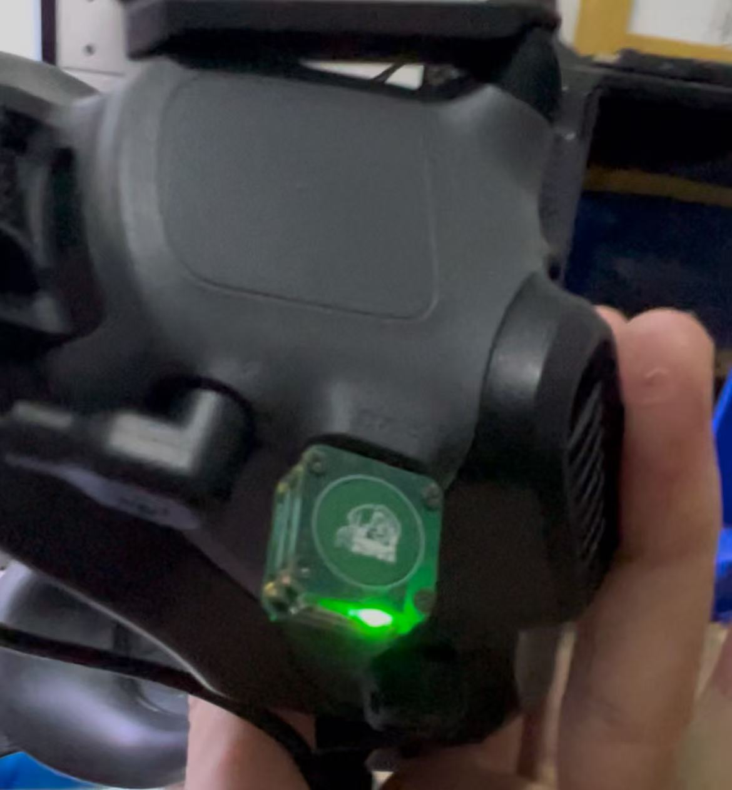
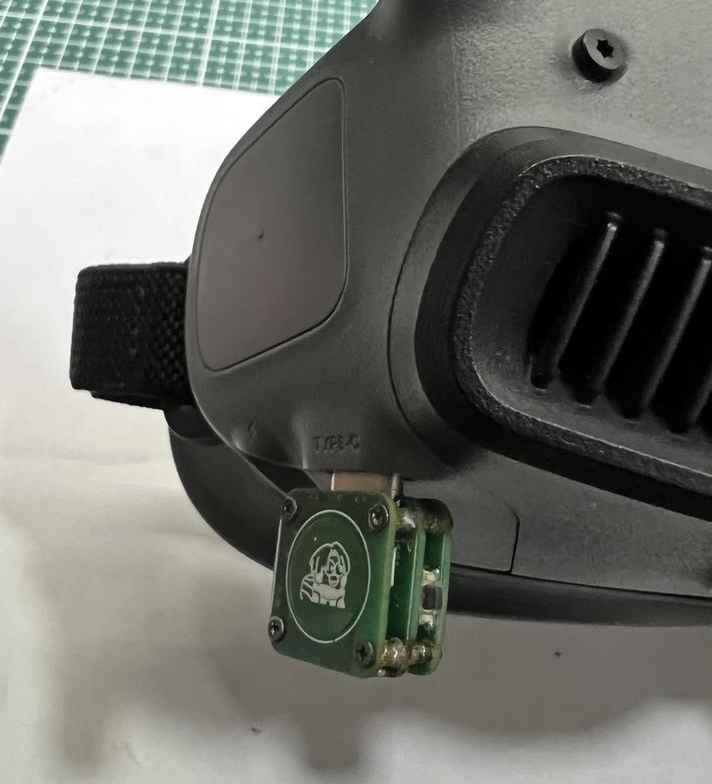

(get-started)=
# 🚀Getting Started

(preparation)=
## 1. Preparation

To use the head tracker supported by this project, you need the following items:

- **Head Tracker Transmitter**
- **Head Tracker Receiver**
- **3.5 mm Audio Cable/Trainer Cable**

:::{seealso}
For specific requirements, please refer to [Hardware Requirements](getting-started/hardware-required.md)
:::

::::{note}
In addition to the items related to the head tracker in this project, you may generally need some other accessories to achieve full head tracking functionality. The exact requirements vary depending on your equipment. The following is for reference only:

:::{admonition} Additional Accessories Reference
:class: tip dropdown
- **FPV Goggles** (e.g., DJI Goggles 2, DJI FPV Goggles N3, etc.)
- **Camera + Video Transmission System** (e.g., DJI O3, DJI O4 Air Unit)
- **Gimbal** (e.g., servo gimbal for mounting the camera)
- **Remote Controller** (must support PPM trainer signal input)
- **Aircraft** (a model aircraft, typically a fixed-wing, for mounting the gimbal)
:::

::::

(update)=
## 2. Firmware Update

The head tracker supports [OTA](getting-started/flashing-firmware.md#ota) firmware updates via WiFi.  

You need a computer or smartphone with WiFi capability. Connect to the hotspot created by the head tracker, upload the firmware, and the update will be completed.  

:::{attention}
Ensure that the transmitter and receiver are running the same firmware version; otherwise, the head tracker may not function properly.  
:::

(insatll)=
## 3. Installation

#### Transmitter

For FPV goggles with Type-C power output, the head tracker transmitter can be **directly plugged into the Type-C port** to operate.  

::::{grid} 1 2 2 2

:::{grid-item}
{.bg-warning w=300px align=center}  
:::

:::{grid-item}
{.bg-warning w=300px align=center}  
:::

::::

:::{hint}
You can use a Type-C to Type-C cable to connect your smartphone to the FPV goggles. If the phone shows it is charging, it indicates the goggles have power output functionality.
:::

#### Receiver

The installation method for the receiver varies depending on the remote controller.  

Some remote controllers allow the receiver to be **placed inside the battery compartment**, sharing a 2S battery with the controller.  
For controllers with limited space, you may need to explore external mounting and power supply options based on the available space.  

:::{seealso}
For more details on installation methods, please refer to [Installation](getting-started/installing.md)
:::

(binding)=
## 4. Binding

The transmitter and receiver only need to be paired once, and no repeated pairing is required afterward (OTA updates do not affect existing pairings).  

**Pairing Steps:**  
**1.** Power on both the transmitter and receiver (order does not matter).  
**2.** **Press and hold** the **micro switch** on the transmitter until the buzzer starts **beeping intermittently**.  
**3.** **Press and hold** the **micro switch** on the receiver to complete the pairing.  

Once paired successfully, the transmitter will emit a **long beep**.

:::{seealso}
For more details on pairing, please refer to [Pairing and Binding](getting-started/binding.md)
:::

(setup)=
## 5. Radio Setup

The setup process varies for different remote controllers, but generally, you need to configure the following:

1. Enable PPM input on the trainer port of the remote controller and set the controller to 'Master' mode.  
2. Adjust the channels on the remote controller to map trainer channels 6, 7, and 8 to the desired channels.

:::{note}
The axis corresponding to each channel may vary depending on the installation orientation of the FPV goggles. Perform a test and adjust the channel mapping based on the actual movement direction.
:::

## 6. Usage Instructions

After configuring the remote controller, simply plug the head tracker transmitter into the Type-C port of the FPV goggles to start using it.  

### Centering
**Tap once** on the capacitive touch button area. A *short beep* will confirm that centering is complete.

### Locking
Sometimes, you may need to *pause motion tracking* and lock the current attitude angle output.  
To do this, **press and hold** the capacitive touch area. A *long beep* will confirm that the current angle is locked.  

To unlock, simply tap once to trigger centering, which will cancel the lock.

:::{attention}
After use, do not forget to turn off the receiver's power to avoid draining the remote controller's battery over time.
:::