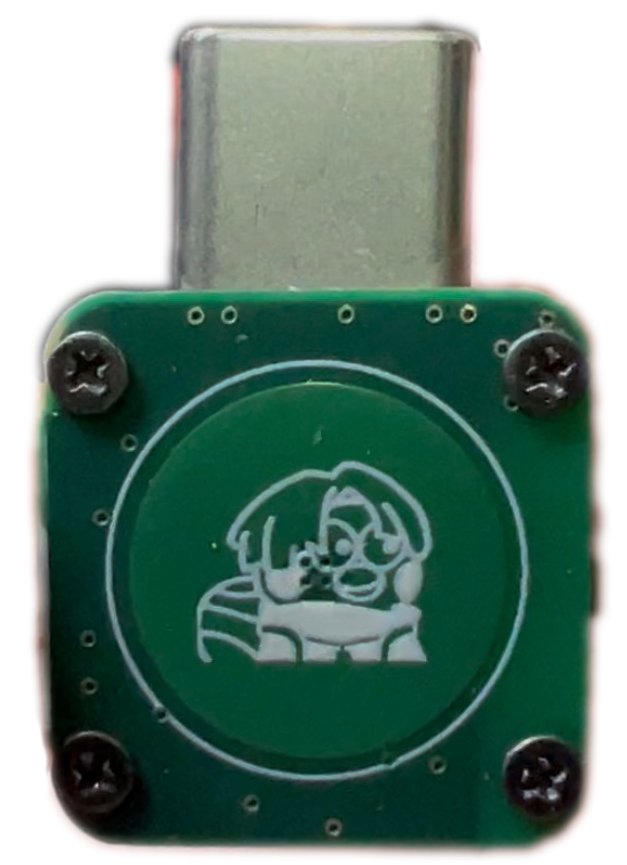

# Hardware Requirements

(TX)=
### Head Tracker Transmitter
You can either **make a finished product yourself** or **purchase a module to assemble**.  

It is recommended to make a finished product yourself. Using a module to assemble has a lower level of integration, is not plug-and-play, and needs to be fixed to the video goggles with Velcro or other means.

Currently, only the Nano version hardware has been released, and it will continue to be optimized and iterated.

{.bg-warning w=300px align=center}  

(RX)=
### Head Tracker Receiver
You can either make a finished product yourself or purchase a module to assemble.  

The difference lies in the *size*. The self-made finished product is smaller and can fit inside some remote controller battery compartments.  

Using a module to assemble will be slightly larger and needs to be attached to the outside of the remote controller.

