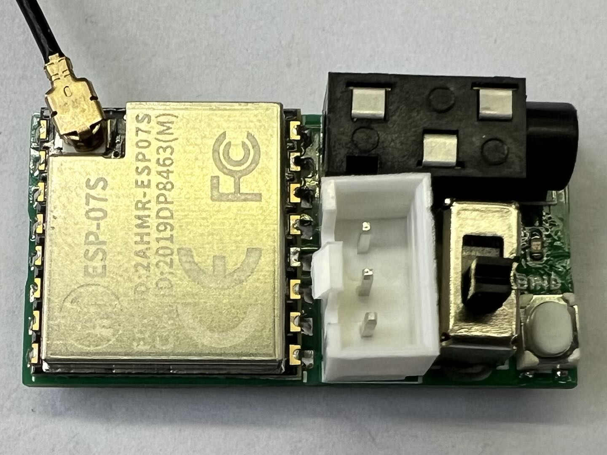

# Hardware Requirements

(TX)=
### Head Tracker Transmitter
You can either **build a finished product yourself** or **purchase modules for assembly**.  
It is recommended to build a finished product yourself. Using modules for assembly results in lower integration, requiring additional fixes like Velcro to attach it to FPV goggles.

Currently, only the Nano version hardware has been released, and it will continue to be optimized and iterated.

::::{grid} 1 2 2 2

:::{grid-item}
{.bg-warning w=300px align=center}  
:::

:::{grid-item}
{.bg-warning w=300px align=center}  
:::

::::

(RX)=
### Head Tracker Receiver
You can either build a finished product yourself or purchase modules for assembly.  
The difference lies in the *size*: a self-built finished product is more compact and can fit inside some transmitter battery compartments.  
Assembled modules are slightly larger and need to be mounted externally on the transmitter.

::::{grid} 1 2 2 2

:::{grid-item}
{.bg-warning w=300px align=center}  
:::

:::{grid-item}
{.bg-warning w=300px align=center}  
:::

::::