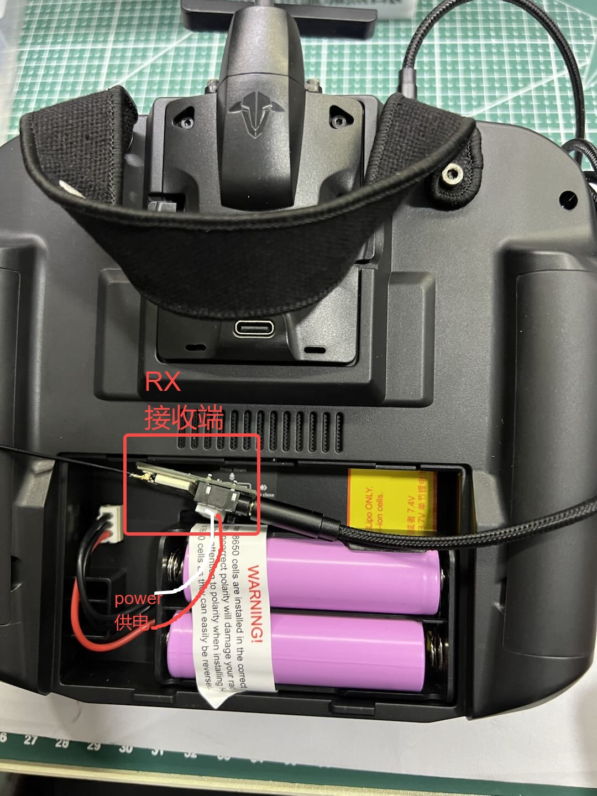
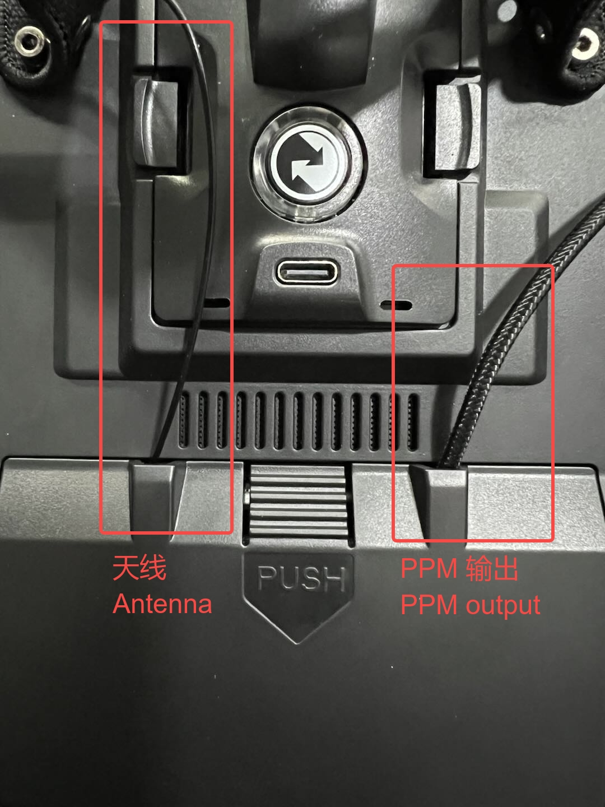

# Installation

## Transmitter

For video goggles with Type-C power output functionality, the head tracker transmitter can **be directly plugged into the Type-C port** to operate.  

::::{grid} 1 2 2 2

:::{grid-item}
{.bg-warning w=300px align=center}  
:::

:::{grid-item}
{.bg-warning w=300px align=center}  
:::

::::

:::{hint}
You can use a Type-C to Type-C cable to connect your phone to the video goggles. Check if the phone shows it is charging to determine if the goggles have power output functionality.
:::

## Receiver

The installation method for the receiver varies depending on the transmitter.  

Some transmitters allow the receiver to **be placed inside the battery compartment**, sharing the 2s battery with the transmitter.  
For transmitters with limited space, you may need to choose alternative mounting and power supply methods, such as external mounting, based on the available space.  

::::{grid} 1 2 2 2

:::{grid-item}
{.bg-warning w=300px align=center}  
:::

:::{grid-item}
{.bg-warning w=300px align=center}  
:::

::::

