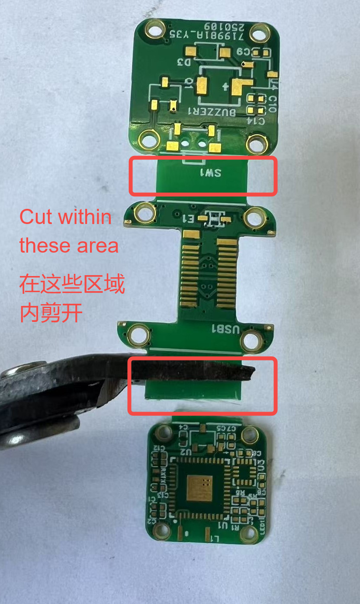
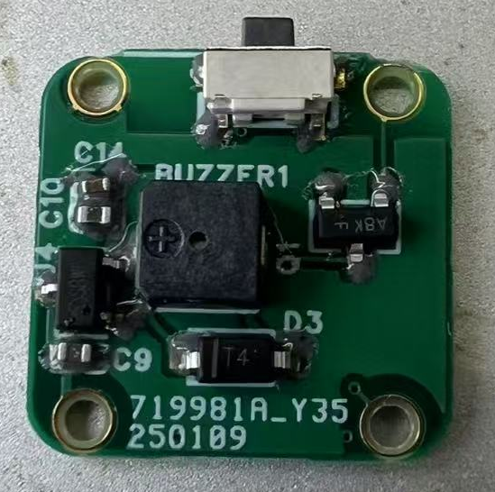
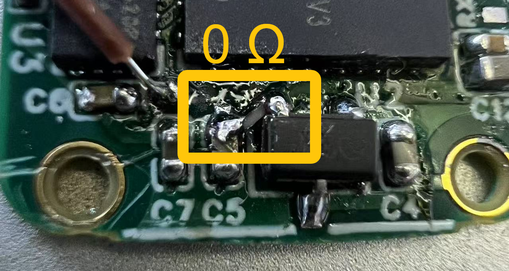
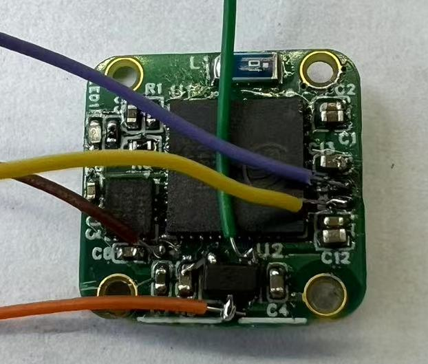
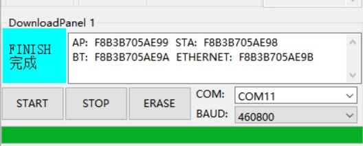
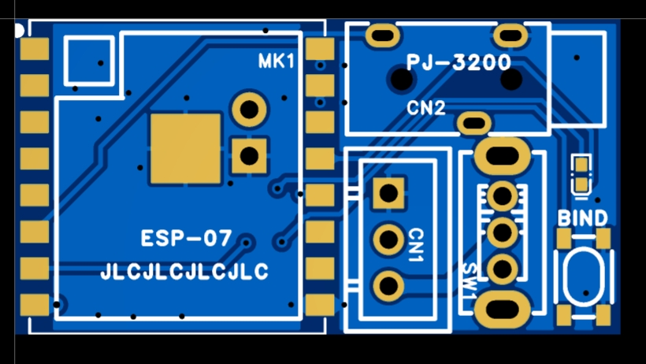
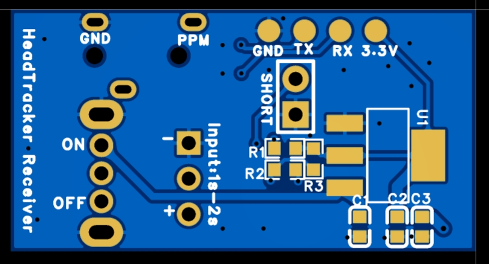
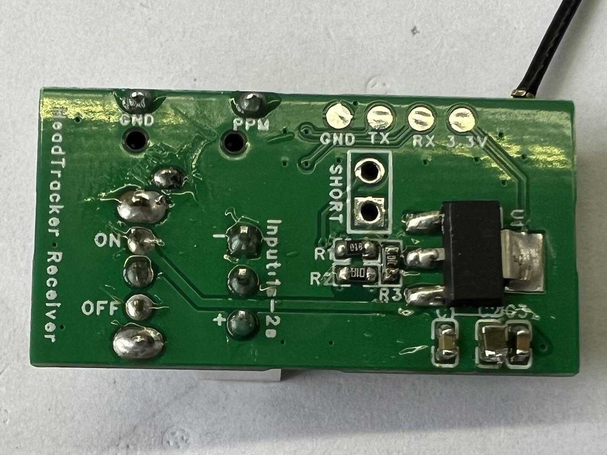
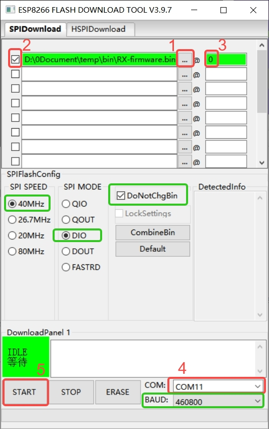

# PCBA

This page will guide you through the hardware assembly of the head tracker, including the **transmitter** and **receiver**.

:::{note}
To obtain the EDA project files, please visit JLC’s [oshwhub](http://oshwhub.com/nineday/headtracker_esp32-nano-wu-xian-tou-zhui)
:::

# Nano Transmitter

## PCB

The PCB design for this project was created using **LCSC EDA Professional Edition**. DIY enthusiasts can take advantage of JLCPCB's monthly free prototyping offer to get the boards fabricated for free.

### 2D Overview

::::{grid} 2

:::{grid-item}

:::
:::{grid-item}

:::
::::

:::{note}
When ordering the PCB, select a finished board thickness of **0.8 mm**, surface finish as **ENIG (Immersion Gold)**, and impedance as **JLC0416H-3313**.

JLCPCB offers a free ENIG prototyping coupon every month, which can be used for free fabrication.
:::

(HT_nano_BOM)=
## Bill of Materials (BOM)

For the detailed BOM, download it here: [BOM_HT_nano.xlsx](../../_static/BOM_HT_nano.xlsx)

:::{dropdown} Preview BOM (Nano TX)
:icon: table
:animate: fade-in-slide-down 
<!-- :open: -->

```{csv-table}
:file: ../../_static/BOM_HT_nano.csv
:delim: tab
:header-rows: 2

```
:::

## Soldering and Assembly

:::{note}
This soldering guide is tailored for those with **limited soldering experience** who wish to assemble the board themselves. It is for reference only; feel free to share better soldering methods if you have any.
:::

Before starting the soldering process, you may need the following tools:

:::{list-table}
:header-rows: 1

*   - Tools
    - Electrical
    - Consumables
*   - [ ] Tweezers
    - [ ] Soldering Iron
    - [ ] Solder Wire
*   - [ ] Flush Cutter
    - [ ] Hot Air Gun
    - [ ] Solder Paste
*   - [ ] File
    - [ ] Reflow Heating Platform
    - [ ] Jumper Wires
*   - [ ] Phillips Screwdriver (PH000)
    - [ ] USB to TTL Module (CH340)
    - [ ] Flux
:::

### 1. Separation
The PCB consists of three small boards joined together. The first step is to separate them.

**Use a flush cutter to cut along the joints, then use a file to smooth the edges.**

::::{grid} 1 2 2 2

:::{grid-item}
{.bg-primary w=300px align=center}
:::

:::{grid-item}
{.bg-primary w=300px align=center}
:::

::::

### 2. Soldering the Main Controller

Due to the compact PCB design, it is recommended to **solder the main controller first** to avoid issues like solder bridging or cold joints during reflow soldering. Ensure the main controller is properly soldered before proceeding with other components.

::::{grid} 1 2 2 2

:::{grid-item}
:::{tip}
Use solder paste and a heating platform for reflow soldering the **ESP32-PICO-V3**.

After reflow, inspect the surrounding pins and remove any solder bridges to prevent short circuits.
:::
:::

:::{grid-item}
{.bg-primary w=300px align=center}
::::

::::{important}

After soldering, use a multimeter to check the connections between the chip pins and the corresponding component pads to **identify any cold joints or short circuits**.

:::{seealso}
For the pin list, refer to the [schematic](schematic.md#io-list).
:::

:::{tip}
To check for cold joints or short circuits, measure the voltage drop between the pad of the first component connected to the pin and GND.

**A good solder joint will show a forward voltage drop greater than 0 and not infinite.**

If the forward voltage drop is infinite, the pin is cold soldered; if it is 0, the pin is shorted to GND.
:::

::::


### 3. Soldering Other Components

::::::{card}

Solder the remaining components on the main controller board, such as the IMU, LDO, resistors, and capacitors, using reflow soldering.

Simultaneously, reflow solder the buzzer board. This board is relatively easier to solder and can also be hand-soldered if preferred.

::::{grid} 1 2 2 2

:::{grid-item}
{.bg-primary w=300px align=center}
:::

:::{grid-item}
{.bg-primary w=300px align=center}
:::

::::

:::::{important}
::::{grid} 1 2 2 2

:::{grid-item}
The LDO on the main controller board has a 0 Ω jumper resistor. Missing this resistor will result in no 3.3 V power supply.
:::

:::{grid-item}
{.bg-primary align=center}
:::

::::
:::::

::::::


:::::::{card}
Next, solder the **Type-C board**. Apply solder paste to the pins, insert the Type-C male and female connectors into the board slots, and use a hot air gun for soldering.

Then, use a soldering iron to solder the reinforcement points for the Type-C connectors. Reinforcement pads are provided near the Type-C slots (marked in red circles).

::::::{grid} 1 1 2 2

::::{grid-item}
:::{tip}
Do not apply too much solder paste to the Type-C pins, as it may cause solder bridging.

Apply solder paste to the end of the pins **away from the base**. During soldering, the solder will flow to the pins. Applying solder paste at the base increases the risk of bridging.
:::
::::

:::::{grid-item}
::::{grid} 2

:::{grid-item}
{.bg-primary align=center}
:::

:::{grid-item}
{.bg-primary align=center}
:::

::::
:::::

::::::

:::::::

At this point, the soldering of the PCB is complete.

{.bg-primary align=center}


### 4. Flashing Initial Firmware

Before assembly, the initial firmware needs to be flashed onto the main controller.

:::::{card}

First, use jumper wires to connect the **`VBUS`**, **`GND`**, **`TX`**, **`RX`**, and **`Download Enable`** pins.

::::{grid} 1 2 2 2

:::{grid-item}
{.bg-primary w=300px align=center}
:::

:::{grid-item}
{.bg-primary w=300px align=center}
:::

::::

Then, connect the main controller board to the USB-to-TTL (CH340) module as follows:

| Main Controller | CH340 |
| :---: | :---: |
| VBUS | 5 V |
| GND | GND |
| TX | RX |
| RX | TX |
| Download Enable | GND |

{.bg-primary align=center}

After connecting the wires, plug the CH340 module into your computer and prepare for flashing.

:::::

:::::{card}

Download the [{octicon}`download`Flash Download Tool](https://dl.espressif.com/public/flash_download_tool.zip) on your Windows computer.

Open the Flash Download Tool, double-click the `.exe` file to enter the main interface. Select `ESP32` for `ChipType`, `Develop` for `WorkMode`, and `UART` for `LoadMode`. Then click `ok` to enter the configuration interface.

{.bg-primary w=300px align=center}

In the configuration interface, follow the steps in the red boxes below, ensuring the parameters in the green boxes are consistent.

::::{grid} 1 2 2 2

:::{grid-item-card}
1. Click `...` and select the firmware file `merged.bin` in the pop-up window.
2. Check the firmware box.
3. Set the flash address to `0`.
4. Select the COM port corresponding to the CH340 module.
5. Click `START` to begin flashing.
:::

:::{grid-item}
{.bg-primary align=center}
:::

::::

After flashing is complete, the following interface will appear.

{.bg-primary align=center}

:::{tip}
After flashing, check if the program runs correctly.

Disconnect the `Download Enable` pin from `GND`, power the main controller board again, and observe if the LED on the board lights up.

**A green light indicates successful flashing** and normal operation.
:::

:::{note}
The initial firmware includes the Bootloader and partition information, which is different from the OTA firmware. **Do not use OTA firmware for flashing**, as it will not work.
:::

:::::

:::{seealso}
For more usage instructions on the Flash Download Tool, refer to the [Espressif Official User Guide](https://docs.espressif.com/projects/esp-test-tools/zh_CN/latest/esp32/production_stage/tools/flash_download_tool.html).
:::

### 5. Assembly

To assemble, solder the standoffs onto the Type-C board and secure the main controller and buzzer boards to the standoffs with screws.

::::{grid} 1 2 2 2

:::{grid-item-card}
First, attach the **standoffs and screws** to the main controller and buzzer boards.

Then, apply solder paste to both the standoff connection pads on the Type-C board and the standoffs themselves.
:::

:::{grid-item}
{.bg-primary align=center}
:::

::::

::::{grid} 1 2 2 2

:::{grid-item-card}
Align the buzzer board with the standoff pads on the Type-C board and place it in position.

Use a soldering iron to heat the standoffs, melting the solder paste.

Repeat the same process for the main controller board.
:::

:::{grid-item}
{.bg-primary align=center}
:::

::::

:::{important}
**This step is prone to cold solder joints! Ensure thorough inspection after soldering!**

If you encounter issues like random LED flickering or frequent disconnections later, it may be due to cold solder joints at the standoff connections on the Type-C board.
:::

### 6. Testing

After assembly, it is recommended to perform the following basic functionality tests:

1. **Capacitive Touch Button** Test.  
    Tap the touch button; the buzzer should emit a sound. A long press will produce a prolonged beep.
2. **Buzzer** Test.  
    Test the buzzer using the same method as the touch button. If there is no sound, check whether the issue lies with the touch button or the buzzer board.
3. **Pairing with Receiver** Test.  
    Follow the [Pairing and Binding](../getting-started/binding.md) instructions to test if pairing works correctly.
4. **OTA Hotspot Connection** Test.  
    Follow the [OTA](../getting-started/flashing-firmware.md) instructions to test if the OTA upgrade page opens correctly.


# Nano Receiver

## PCB

### 2D Overview

::::{grid} 1 2 2 2

:::{grid-item}

:::
:::{grid-item}

:::
::::

:::{note}
When ordering the PCB, select a finished board thickness of **1.0 mm**, and surface finish as **HASL with Lead** or **Lead-Free HASL** (not free).

JLCPCB offers a free 2-4 layer board prototyping coupon every month, which can be used for free fabrication.
:::

(RE_PPM_BOM)=
## Bill of Materials (BOM)

For the detailed BOM, download it here: [BOM_Receiver_ppm.xlsx](../../_static/BOM_Receiver_ppm.xlsx)

:::{dropdown} Preview BOM (Nano RX)
:icon: table
:animate: fade-in-slide-down 
<!-- :open: -->

```{csv-table}
:file: ../../_static/BOM_Receiver_ppm.csv
:delim: tab
:header-rows: 2

```
:::


## Soldering and Assembly

The soldering process for the receiver is relatively simple, so only a brief overview is provided here.

### 1. Soldering

::::{grid} 1 2 2 2

:::{grid-item-card}
First, solder the **ESP-07S** module.

Ensure the **ground pad on the bottom** is soldered properly, preferably using solder paste, to improve heat dissipation and provide a better current return path.

Then solder the remaining components.

Pay attention to the orientation of the XH2.54-3P connector.
:::

:::{grid-item}


:::

::::

### 2. Flashing Firmware

::::{grid} 1 2 2 2

:::{grid-item-card}
The bottom of the board has reserved pads for the flashing serial port. Connect them to the USB-to-TTL module (CH340) as follows:

| Receiver | CH340 |
| :---: | :---: |
| 3.3 V | 3.3 V |
| GND | GND |
| TX | RX |
| RX | TX |
:::

:::{grid-item}

:::

::::

:::{card}
Before powering the CH340, use **tweezers to short** the two pads labeled **`SHORT`** on the bottom of the board. This will put the board into FLASH mode.

**Keep the pads shorted**, then plug the CH340 into the computer's USB port. Once powered, you can release the short and prepare for flashing.
:::

::::{grid} 1 2 2 2

:::{grid-item-card}
**Open the Flash Download Tool**, double-click the `.exe` file to enter the main interface. Select `ESP8266` for `ChipType`, `Develop` for `WorkMode`, and `UART` for `LoadMode`. Then click `ok` to enter the configuration interface.
:::

:::{grid-item}

:::

::::

In the configuration interface, follow the steps in the red boxes below, ensuring the parameters in the green boxes are consistent.

::::{grid} 1 2 2 2

:::{grid-item-card}
1. Click `...` and select the firmware file `RX-firmware.bin` in the pop-up window.
2. Check the firmware box.
3. Set the flash address to `0`.
4. Select the COM port corresponding to the CH340 module.
5. Click `START` to begin flashing.
:::

:::{grid-item}
{.bg-primary align=center}
:::

::::

After flashing is complete, the following interface will appear.

{.bg-primary align=center}


### 3. Testing

After assembly, it is recommended to perform the following basic functionality tests:

1. **LED** Test.  
    Insert a **2S battery** into the battery connector. Once powered, the LED will light up automatically if the program is running.
3. **Pairing with Transmitter** Test.  
    Follow the [Pairing and Binding](../getting-started/binding.md) instructions to test if pairing works correctly.
4. **PPM Output** Test.  
    Use a 3.5 mm audio cable to connect the receiver to the trainer port of the remote controller. Configure the trainer port on the remote controller and test for signal output.
