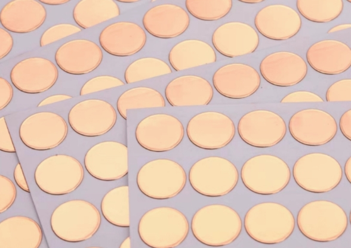
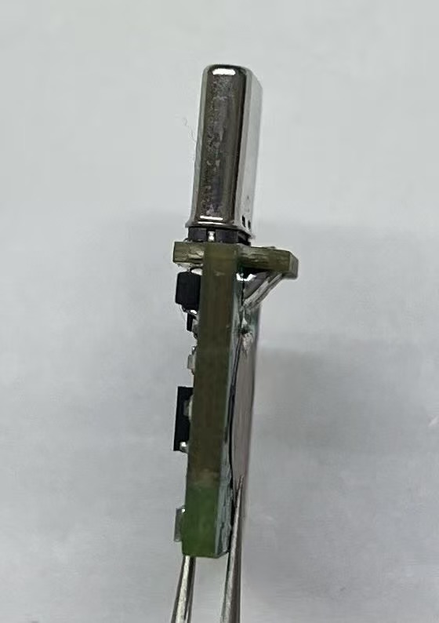
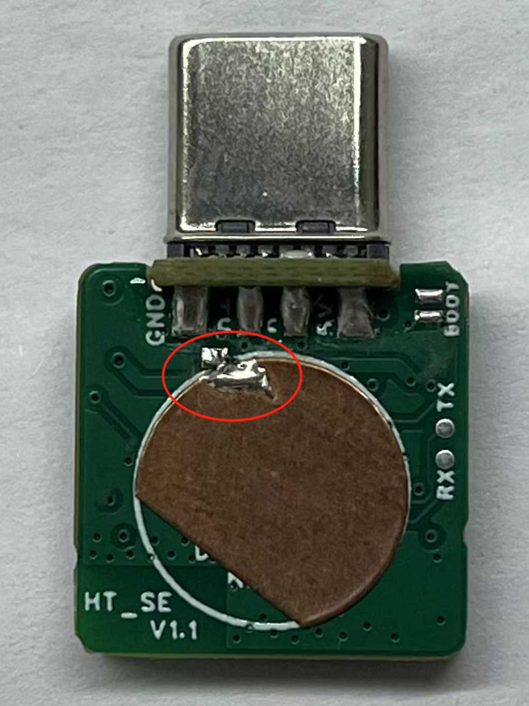

# SE PCBA

This page will guide you through the hardware assembly of the **SE version** Head Tracker, including both the **transmitter** and **receiver**.

:::{note}
To obtain the project files, please visit [oshwhub](https://oshwhub.com/nineday/headtracker_esp32-se-ban-wu-xian-tou-zhui)
:::

:::{note}
The SE hardware has not been officially released yet. Information will be updated later. Firmware version `v1.1.x` or above is required.
:::

# SE Transmitter

## PCB

The PCB project is designed using **LCSC EDA Professional Edition**. DIY users can use LCSC's free PCB prototyping activity to get free boards every month.

### 2D Overview

::::{grid} 2

:::{grid-item}

:::
:::{grid-item}

:::
::::

:::{note}
When ordering the PCB, select a finished board thickness of **1.6** and material **JLC04161H-7628**.
:::

(ht-se-bom)=
## Bill of Materials

For the detailed BOM, click to download: [BOM_HT_se.xlsx](../../_static/BOM_HT_se.xlsx)

:::{dropdown} Preview BOM (SE TX)
:icon: table
:animate: fade-in-slide-down 
<!-- :open: -->

```{csv-table}
:file: ../../_static/BOM_HT_se.csv
:delim: tab
:header-rows: 2

```
:::

## Soldering & Assembly

:::{note}
The SE version uses single-sided SMD soldering, which is relatively easy. Therefore, the SMT process is not described here.
:::


### 1. Prepare Materials
You can use LCSC's assembly service, or do the SMD soldering yourself using reflow soldering.

After SMD soldering, you need to prepare the following materials:

| No. | Material Name         | Image                                                         |
|-----|----------------------|---------------------------------------------------------------|
| 1   | Assembled mainboard  |  |
| 2   | Type-C male with board |    |
| 3   | Copper foil          |         |
| 4   | High-temp tape       |      |

### 2. Solder Type-C

::::{grid} 1 2 2 2

:::{grid-item-card}
Solder the Type-C male connector to the mainboard.

Solder the four pads on the mainboard to the four pins of the Type-C connector. Make sure the orientation of the Type-C connector is correct during soldering.
:::

:::{grid-item}

:::

::::

### 3. Solder Copper Foil

::::{grid} 1 2 2 2

:::{grid-item-card}
The copper foil is the touch sensing area.

1. Cut off one corner of the copper foil, then stick it inside the circular silkscreen area.
2. Short the `TOUCH` pin to the copper foil with solder.
:::

:::{grid-item}

:::

::::

### 4. Flash Firmware
1. Short the `BOOT` pad.
2. Connect the Type-C male connector of the tracker to your computer.
3. Use the flashing tool to flash the firmware (refer to the PC operation part in [Nano Flashing Tutorial](Nano_PCBA.md#ht-nano-flash)).
4. After flashing, disconnect the `BOOT` pad.

### 5. Apply High-temp Tape

::::{grid} 1 2 2 2

:::{grid-item-card}
Cut a suitable length of high-temperature tape and stick it on the side with the copper foil.

**Capacitive touch must have high-temp tape applied to work.** Do not touch the copper foil directly with your finger.
:::

:::{grid-item}

:::

::::

***

# Nano Receiver

## PCB

### 2D Overview

::::{grid} 1 2 2 2

:::{grid-item}

:::
:::{grid-item}

:::
::::

(rx-se-bom)=
## Bill of Materials

For the detailed BOM, click to download: [BOM_RX_se.xlsx](../../_static/BOM_RX_se.xlsx)

:::{dropdown} Preview BOM (SE RX)
:icon: table
:animate: fade-in-slide-down 
<!-- :open: -->

```{csv-table}
:file: ../../_static/BOM_RX_se.csv
:delim: tab
:header-rows: 2

```
:::

## Soldering & Assembly

:::{card}
The receiver is relatively simple. After SMD soldering, just flash the firmware.

Flashing is the same as the transmitter: short the `BOOT` pad, connect Type-C to the computer, and use the flashing tool to flash the firmware.

No further details here.
:::