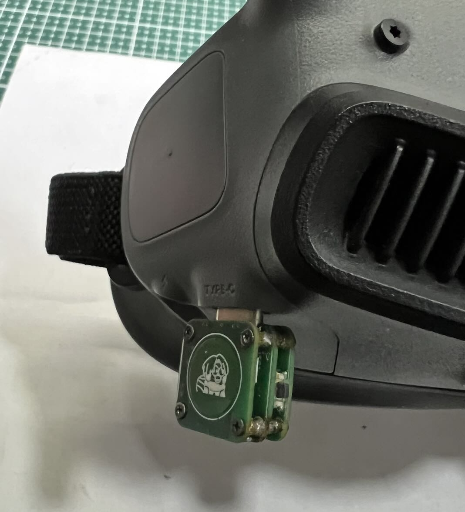

(get-started)=
# 🚀快速上手

(preparation)=
## 1. 准备工作

使用本项目支持的头追，你需要准备以下东西

- **头追发射端**
- **头追接收端**
- **3.5 mm 耳机线/教练线**

:::{seealso}
具体要求请查看 [硬件要求](getting-started/hardware-required.md)
:::

::::{note}
除了以上与本项目头追有关的东西，一般来说，你还需要一些其他配件才能实现完整的头追功能。每个人根据自己的设备情况会有所不同，这里只做参考。 

:::{admonition} 其他配件参考
:class: tip dropdown
- **视频眼镜**（如 DJI Goggles 2，DJI 飞行眼镜 N3 等）
- **摄像头 + 图传**（如 DJI O3, DJI O4 天空端）
- **云台**（如舵机云台，用于安装摄像头）
- **遥控器**（需要支持 PPM 教练信号接入功能）
- **载机**（用于搭载云台的航模，一般为固定翼）
:::

::::

(update)=
## 2. 更新固件

头追支持通过 WiFi 进行 [OTA](getting-started/flashing-firmware.md#ota) ，以此来更新固件。  

你需要一台可连接 WiFi 的电脑或者手机，通过连接头追创建的热点，将固件上传到头追，即可实现更新固件。  

:::{attention}
使用头追时需要确保发射端和接收端的版本一致，否则可能会导致头追工作不正常。  
:::

(insatll)=
## 3. 安装

#### 发射端

对于有 Type-C 电源输出功能的视频眼镜，头追发射端可**直接插到 Type-C 处**工作。  

::::{grid} 1 2 2 2

:::{grid-item}
{.bg-warning w=300px align=center}  
:::

:::{grid-item}
{.bg-warning w=300px align=center}  
:::

::::

:::{hint}
可以通过使用 Type-C to Type-C 线，将手机连接到视频眼镜上，查看手机是否有显示正在充电来判断是否有电源输出功能。
:::

#### 接收端

不同的遥控器安装方法会有所不同。  

一些遥控器可以将接收端**放在电池仓**内，与遥控器共用 2s 电池。  
空间不足的遥控器需要根据自身空间，选择如外置等其他方式进行固定和供电。  

:::{seealso}
更多有关安装方法的内容，请查看 [安装](getting-started/installing.md)
:::

(binding)=
## 4. 配对绑定

发射端与接收端只需配对一次，后续无需重复配对（OTA不影响原有配对）。  

**配对方法如下：**  
**1.** 给发射端与接收端通电工作（不分先后）  
**2.** 长按发射端的微动开关，直到听到蜂鸣器开始间隔响  
**3.** 长按接收端的微动开关，即可完成配对  

配对成功后，发射端会长响一声。

:::{seealso}
更多有关配对的内容，请查看 [配对绑定](getting-started/binding.md)
:::

(setup)=
## 5. 遥控器设置

每款遥控器的设置方式都不同，但总的来说需要设置以下几点：
1. 打开遥控器教练口PPM输入，将遥控器设置为 'Master' 
2. 调整遥控器的通道，将教练通道的 6,7,8 通道，映射到你需要的通道上

:::{note}
通道对应的轴向，会因不同视频眼镜的安装方向不同而不同。需要实测后根据实际运动方向来设置你的通道。
:::

## 6. 使用方法

设置好遥控器配置后，只需将头追发射端直接插入到视频眼镜的 Type-C 接口，即可开始使用。  

### 回中
**短按一下**电容触摸按钮区域，伴随一声*短蜂鸣声*，即可回中。

### 锁定
有的时候需要*暂停运动解析*，锁定当前姿势角度输出。  
这时可以一通过**长按一下**电容触摸区域，伴随一声*长蜂鸣声*，即可锁定当前角度。  

解除锁定只需短按一下，触发回中，即可取消锁定。

:::{attention}
使用完后，请勿忘记将接收端电源关闭，避免长时间消耗遥控器电量。
:::