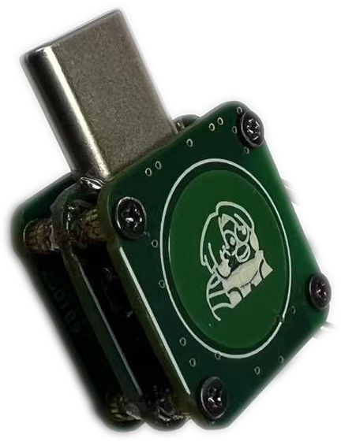

# 硬件要求

(TX)=
### 头追发射端
可以**自制成品**或者**购买模块组装**。  
推荐使用自制成品。使用模块组装集成度较低，无法即插即用，需要使用魔术贴等固定在视频眼镜上。

目前仅发布了 Nano 版本硬件，且会持续优化迭代。

::::{grid} 1 2 2 2

:::{grid-item}
{.bg-warning w=300px align=center}  
:::

:::{grid-item}
{.bg-warning w=300px align=center}  
:::

::::

(RX)=
### 头追接收端
可以自制成品或者购买模块组装。  
区别在于*尺寸大小*，自制成品的尺寸较小，可以塞进一些遥控器电池仓内部。  
使用模块组装体积会稍大，需要外挂在遥控器外部。

::::{grid} 1 2 2 2

:::{grid-item}
{.bg-warning w=300px align=center}  
:::

:::{grid-item}
{.bg-warning w=300px align=center}  
:::

::::