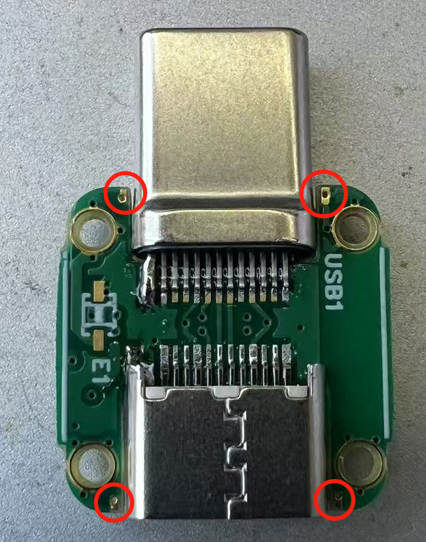

# Nano PCBA

本页面会指导您完成 **Nano 版** 头追硬件的制作，包括**发射端**和**接收端**。

:::{note}
获取工程文件，请跳转至[立创开源广场](http://oshwhub.com/nineday/headtracker_esp32-nano-wu-xian-tou-zhui)
:::

# Nano 发射端

## PCB

本项目的 PCB 工程使用**立创 EDA 专业版**设计。 DIY 玩家可以通过嘉立创每个月的免费打样活动来免费打板。  

### 2D 图概览

::::{grid} 2

:::{grid-item}

:::
:::{grid-item}

:::
::::

:::{note}
PCB 下单时，成品板厚选择 **0.8**，焊盘喷镀选择**沉金**，阻抗选择 **JLC0416H-3313**。

嘉立创每个月可领取一张免费沉金打样券，可以使用此券来免费打样。
:::

(HT_nano_BOM)=
## 物料清单

详细物料清单(BOM)，点击下载BOM。[BOM_HT_nano.xlsx](../../_static/BOM_HT_nano.xlsx)

:::{dropdown} 预览物料清单（Nano TX）
:icon: table
:animate: fade-in-slide-down 
<!-- :open: -->

```{csv-table}
:file: ../../_static/BOM_HT_nano.csv
:delim: tab
:header-rows: 2

```
:::

## 焊接组装

:::{note}
本指南的焊接教程**针对焊接经验较少**，想要自行焊接的朋友。仅供参考，如果你有更好的焊接方法也欢迎分享。
:::

在开始焊接组装前，你可能需要**准备以下工具**

:::{list-table}
:header-rows: 1

*   - 工具类
    - 电器类
    - 耗材类
*   - [ ] 镊子
    - [ ] 电烙铁
    - [ ] 焊锡
*   - [ ] 剪钳
    - [ ] 热吹风
    - [ ] 锡膏
*   - [ ] 锉刀
    - [ ] 回流焊加热台
    - [ ] 飞线
*   - [ ] 十字螺丝刀 (PH000)
    - [ ] USB 转 TTL 模块 (CH340)
    - [ ] 助焊剂
:::

### 1. 分割
PCB由三块小板拼接而成，第一步要先将他们分开。

**使用剪钳从拼接处剪开，然后用锉刀修整边缘。**

::::{grid} 1 2 2 2

:::{grid-item}
{.bg-primary w=300px align=center}
:::

:::{grid-item}
{.bg-primary w=300px align=center}
:::

::::

### 2. 焊接主控

因为 PCB 设计比较紧凑，为了避免回流焊时产生连锡、虚焊等现象，**建议先焊接主控，确认主控焊接没问题后再焊接其余元器件**。

::::{grid} 1 2 2 2

:::{grid-item}
:::{tip}
使用锡膏和加热台，进行回流焊，以此来焊接 **ESP32-PICO-V3** 。

回流焊后，对周围引脚进行检查，将连锡清除，避免短路。
:::
:::

:::{grid-item}
{.bg-primary w=300px align=center}
::::

::::{important}

焊接完成后，需要使用万用表对芯片引脚连接的元器件焊盘进行检测，**排查虚焊短路**。

:::{seealso}
引脚列表请查看[原理图](Nano_schematic.md#io-list-Nano)。
:::

:::{tip}
排查虚焊短路时，可以通过测量与该引脚连接的第一个元器件的焊盘，与 GND 之间的压降来实现。

**焊接良好时，正向压降应大于 0 且不为无穷大。**

若正向压降为无穷大，则该引脚虚焊，接触不良；若正向压降为 0，则该引脚与 GND 短路。
:::

::::


### 3. 焊接其他

::::::{card}

将主控板上的其他元器件焊接好。可以通过回流焊将 IMU、LDO、电阻电容等元器件焊接到位。

同时，将蜂鸣器所在的板子一起回流焊。此块板子焊接难度较低，也可选择手焊。

::::{grid} 1 2 2 2

:::{grid-item}
{.bg-primary w=300px align=center}
:::

:::{grid-item}
{.bg-primary w=300px align=center}
:::

::::

:::::{important}
::::{grid} 1 2 2 2

:::{grid-item}
主控板上的 LDO 有一个 0 Ω 的短接电阻，如果遗漏会导致没有 3.3 V 供电。
:::

:::{grid-item}
{.bg-primary align=center}
:::

::::
:::::

::::::


:::::::{card}
接下来**焊接 Type-C 板**。需要使用锡膏，给引脚上锡后，将 Type-C 公头和母头分别插入板槽内，然后使用热吹风进行焊接。

接着使用电烙铁，给 Type-C 头焊接加固点。板上边缘贴近 Type-C 槽处预留了加固焊盘（红圈所示）。

::::::{grid} 1 1 2 2

::::{grid-item}
:::{tip}
Type-C 引脚处**锡膏量不宜过多**，否则容易连锡。

锡膏建议涂在**远离针脚根部一端**，焊接时锡会自动爬到针脚上。锡膏涂在根部容易连锡。
:::
::::

:::::{grid-item}
::::{grid} 2

:::{grid-item}
{.bg-primary align=center}
:::

:::{grid-item}
{.bg-primary align=center}
:::

::::
:::::

::::::

:::::::

至此，PCB 的焊接部分已完成。

{.bg-primary align=center}


### 4. 烧录初始固件

在进行组装前，需要给主控烧录初始固件。

:::::{card}

首先将 **`VBUS`**、**`GND`**、**`TX`**、**`RX`** 和 **`下载使能`** 引脚，用飞线连接出来。

::::{grid} 1 2 2 2

:::{grid-item}
{.bg-primary w=300px align=center}
:::

:::{grid-item}
{.bg-primary w=300px align=center}
:::

::::

接着按照以下线序，将主控板与 USB 转 TTL （CH340）模块相连接。

| 主控板 | CH340 |
| :---: | :---: |
| VBUS | 5 V |
| GND | GND |
| TX | RX |
| RX | TX |
| 下载使能 | GND |

{.bg-primary align=center}

连接好线后，将 CH340 模块插入电脑中，开始准备烧录。

:::::

:::::{card}

首先在电脑（Windows 系统）上下载 [{octicon}`download`Flash 下载工具](https://dl.espressif.com/public/flash_download_tool.zip)

打开 Flash 下载工具，双击 `.exe` 文件后进入工具主界面，如下图所示，`ChipType` 选择 `ESP32`，`WorkMode` 选择 `Develop`，`LoadMode` 选择 `UART`。然后点击 `ok` 进入配置界面。

{.bg-primary w=300px align=center}

进入配置界面后，按照以下红框所示顺序进行烧录，同时确保绿框内的参数一致。

::::{grid} 1 2 2 2

:::{grid-item-card}
1. 点击 `...`，在弹出的窗口选择要烧录的文件 `merged.bin`。
2. 勾选固件。
3. 设置烧录地址为 `0`。
4. 选择 CH340 模块对应的 COM 口。
5. 点击 `START` 开始烧录。
:::

:::{grid-item}
{.bg-primary align=center}
:::

::::

烧录完成后会显示以下界面。

{.bg-primary align=center}

:::{tip}
烧录完成后，检查一下程序是否能正常运行。

将`下载使能`与 `GND` 断开连接，重新给主控板上电，观察主控板上的LED是否亮起。

**绿灯亮起代表烧录成功**，程序正常工作。
:::

:::{note}
初始固件为包含了 Bootloader 和分区信息的的固件，与 OTA 所用固件不同。**请勿选择 OTA 的固件来烧录**，否则无法工作。
:::

:::::

:::{seealso}
关于此 Flash 下载工具的更多使用指南，可查看 [Espressif 官方用户指南](https://docs.espressif.com/projects/esp-test-tools/zh_CN/latest/esp32/production_stage/tools/flash_download_tool.html)。
:::

### 5. 组装

组装需要将螺柱焊接到 Type-C 板上，和将主控板和蜂鸣器板用螺丝固定到螺柱上。

::::{grid} 1 2 2 2

:::{grid-item-card}
首先将**螺柱与螺丝**锁到主控板和蜂鸣器板上。

然后在 Type-C 板的螺柱连接焊盘和螺柱上都**涂上锡膏**。
:::

:::{grid-item}
{.bg-primary align=center}
:::

::::

::::{grid} 1 2 2 2

:::{grid-item-card}
将蜂鸣器板按方向，对准 Type-C 板的螺柱焊盘放置。

然后使用电烙铁加热螺柱，使锡膏融化。

主控板同理进行焊接。


:::

:::{grid-item}
{.bg-primary align=center}
:::

::::

:::{important}
**此步骤非常容易虚焊！焊接后务必进行检查！**

如果后续出现灯莫名闪烁，或者经常断联等现象，有可能就是螺柱与 Type-C 板连接处虚焊。
:::

### 6. 测试

制作完成后推荐进行以下的基本功能测试：

1. 电容**触摸按键**测试。  
    点击触摸按键，蜂鸣器会发出声音，长按会长响一声。
2. **蜂鸣器**测试。  
    测试方法同触摸按钮。没有声音需要排查是触摸的问题还是蜂鸣器板问题。
3. 与接收端**配对**测试。  
    按照[配对绑定](../getting-started/binding.md)的方法测试是否能正常配对。
4. **OTA** 热点连接测试。  
    按照 [OTA](../getting-started/flashing-firmware.md) 的方法测试是否能正常打开 OTA 升级页面。


# Nano 接收端

## PCB

### 2D 图概览

::::{grid} 1 2 2 2

:::{grid-item}

:::
:::{grid-item}

:::
::::

:::{note}
PCB 下单时，成品板厚选择 **1.0**，焊盘喷镀选择**有铅喷锡**或**无铅喷锡**（不能免费）。

嘉立创每个月可领取一张2至4层板免费打样券，可以使用此券来免费打样。
:::

(RE_PPM_BOM)=
## 物料清单

详细物料清单(BOM)，点击下载BOM。[BOM_Receiver_ppm.xlsx](../../_static/BOM_Receiver_ppm.xlsx)

:::{dropdown} 预览物料清单（Nano RX）
:icon: table
:animate: fade-in-slide-down 
<!-- :open: -->

```{csv-table}
:file: ../../_static/BOM_Receiver_ppm.csv
:delim: tab
:header-rows: 2

```
:::


## 焊接组装

接收端的焊接比较简单，此处只做简单的流程说明。焊接过程不做过多叙述。

### 1. 焊接

::::{grid} 1 2 2 2

:::{grid-item-card}
先焊接 **ESP-07S** 模块。

注意**底部的地焊盘**最好使用锡膏焊接上，可以提高导热，提供更好的电流回流路径。

然后焊接剩余的器件。

注意 XH2.54-3P 端子的方向。
:::

:::{grid-item}


:::

::::

### 2. 烧录固件

::::{grid} 1 2 2 2

:::{grid-item-card}
板子底部预留了烧录串口焊盘。按照以下顺序与 USB 转 TTL 模块（CH340）连接。

| 接收端 | CH340 |
| :---: | :---: |
| 3.3 V | 3.3 V |
| GND | GND |
| TX | RX |
| RX | TX |
:::

:::{grid-item}

:::

::::

:::{card}
给 CH340 通电前，用**镊子夹住**底部 **`SHORT`** 的两个焊盘，**短接**这两个引脚，进入 FLASH 烧录模式。

**保持短接**，将 CH340 插到电脑 USB 口**通电后即可松开**，准备开始烧录。
:::

::::{grid} 1 2 2 2

:::{grid-item-card}
**打开 Flash 下载工具**，双击 `.exe` 文件后进入工具主界面，如下图所示，`ChipType` 选择 `ESP8266`，`WorkMode` 选择 `Develop`，`LoadMode` 选择 `UART`。然后点击 `ok` 进入配置界面。
:::

:::{grid-item}

:::

::::

进入配置界面后，按照以下红框所示顺序进行烧录，同时确保绿框内的参数一致。

::::{grid} 1 2 2 2

:::{grid-item-card}
1. 点击 `...`，在弹出的窗口选择要烧录的文件 `RX-firmware.bin`。
2. 勾选固件。
3. 设置烧录地址为 `0`。
4. 选择 CH340 模块对应的 COM 口。
5. 点击 `START` 开始烧录。
:::

:::{grid-item}
{.bg-primary align=center}
:::

::::

烧录完成后会显示以下界面。

{.bg-primary align=center}


### 3. 测试

制作完成后推荐进行以下的基本功能测试：

1. **LED** 测试。  
    在电池接口处插入一个 **2S 电池**，通电程序运行后 LED 会自动亮起。
3. 与发射端**配对**测试。  
    按照[配对绑定](../getting-started/binding.md)的方法测试是否能正常配对。
4. **PPM** 输出测试。  
    使用一根 3.5 mm 的耳机线，将接收端与遥控器教练口连接到一起。在遥控器端配置教练口，测试是否有信号输出。