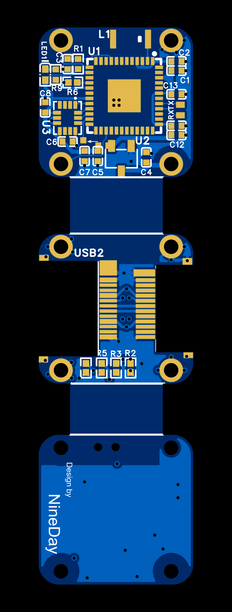

# PCBA

:::{note}
获取工程文件，请跳转至[立创开源广场](http://oshwhub.com/nineday/headtracker_esp32-nano-wu-xian-tou-zhui)
:::

# Nano 发射端

## PCB

本项目的 PCB 工程使用**立创 EDA 专业版**设计。 DIY 玩家可以通过嘉立创每个月的免费打样活动来免费打板。  

### 2D 图概览

::::{grid} 2

:::{grid-item}

:::
:::{grid-item}

:::
::::

(BOM)=
## 物料清单

## 焊接组装

在开始焊接组装前，你可能需要准备以下工具

:::{list-table}
:header-rows: 1

*   - 工具类
    - 电器类
    - 耗材类
*   - [ ] 镊子
    - [ ] 电烙铁
    - [ ] 焊锡
*   - [ ] 剪钳
    - [ ] 热吹风
    - [ ] 锡膏
*   - [ ] 锉刀
    - [ ] 回流焊加热台
    - [ ] 飞线
*   - [ ] 十字螺丝刀 (PH000)
    - [ ] USB 转 TTL 模块 (CH340)
    - 
:::

### 1. 分割
PCB由三块小板拼接而成，第一步要先将他们分开。

**使用剪钳从拼接处剪开，然后用锉刀修整边缘。**

::::{grid} 1 2 2 2
:::{grid-item}
{.bg-primary w=300px align=center}
:::
:::{grid-item}
{.bg-primary w=300px align=center}
:::
::::

### 2. 焊接主控

### 3. 焊接其他

### 4. 烧录初始固件

### 5. 组装

### 6. 测试

# Nano 接收端