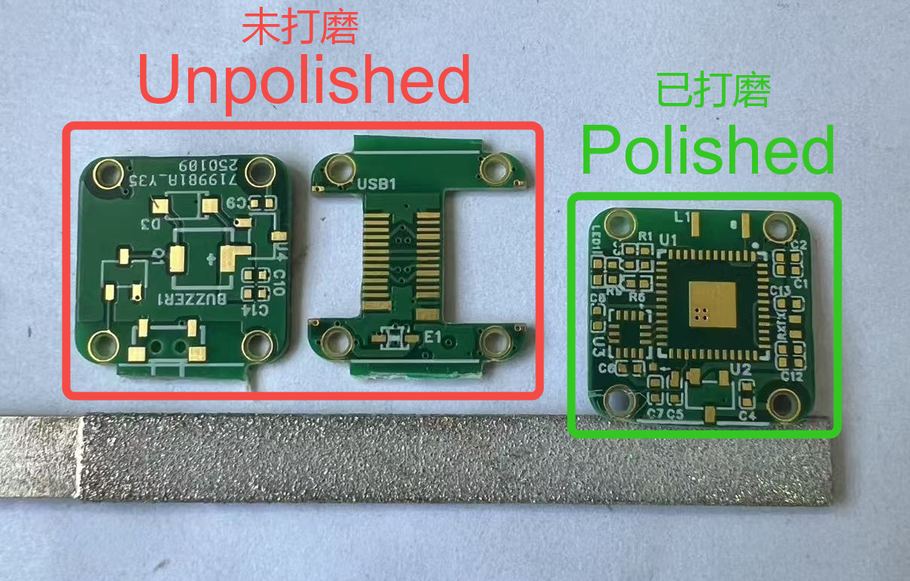
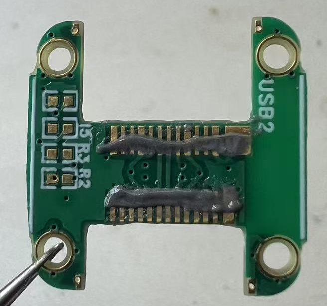
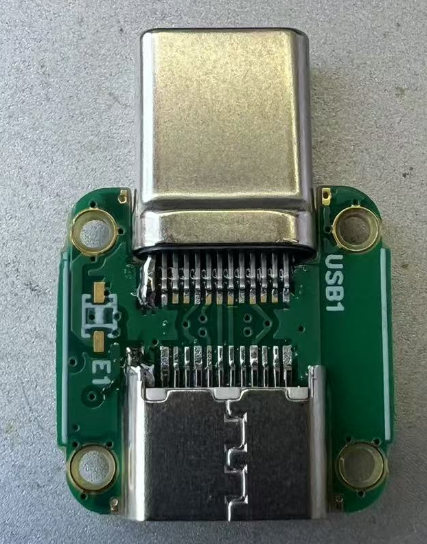
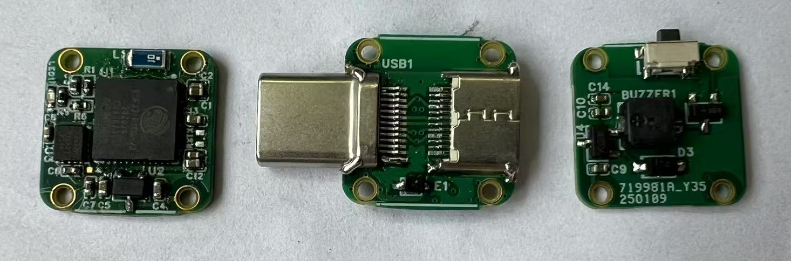
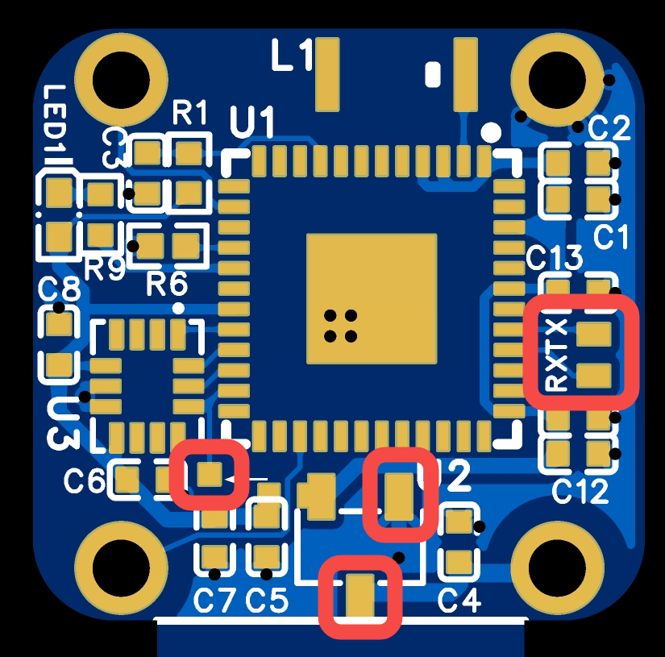

# PCBA

本页面会指导您完成头追硬件的制作，包括发射端和接收端。

:::{note}
获取工程文件，请跳转至[立创开源广场](http://oshwhub.com/nineday/headtracker_esp32-nano-wu-xian-tou-zhui)
:::

# Nano 发射端

## PCB

本项目的 PCB 工程使用**立创 EDA 专业版**设计。 DIY 玩家可以通过嘉立创每个月的免费打样活动来免费打板。  

### 2D 图概览

::::{grid} 2

:::{grid-item}

:::
:::{grid-item}

:::
::::

:::{note}
PCB 下单时，成品板厚选择 **0.8**，焊盘喷镀选择**沉金**，阻抗选择**JLC0416H-3313**。

嘉立创每个月可领取一张免费沉金打样券，可以使用此券来免费打样。
:::

(BOM)=
## 物料清单

详细物料清单(BOM)，点击下载BOM。[BOM_HT_nano.xlsx](../../_static/BOM_HT_nano.xlsx)

:::{dropdown} 预览物料清单（点击收起）
:open:
:icon: table
:animate: fade-in-slide-down 

```{csv-table}
:file: ../../_static/BOM_HT_nano.csv
:delim: tab
:header-rows: 2

```
:::

## 焊接组装

:::{note}
本指南的焊接教程**针对焊接经验较少**，想要自行焊接的朋友。仅供参考，如果你有更好的焊接方法也欢迎分享。
:::

在开始焊接组装前，你可能需要**准备以下工具**

:::{list-table}
:header-rows: 1

*   - 工具类
    - 电器类
    - 耗材类
*   - [ ] 镊子
    - [ ] 电烙铁
    - [ ] 焊锡
*   - [ ] 剪钳
    - [ ] 热吹风
    - [ ] 锡膏
*   - [ ] 锉刀
    - [ ] 回流焊加热台
    - [ ] 飞线
*   - [ ] 十字螺丝刀 (PH000)
    - [ ] USB 转 TTL 模块 (CH340)
    - [ ] 助焊剂
:::

### 1. 分割
PCB由三块小板拼接而成，第一步要先将他们分开。

**使用剪钳从拼接处剪开，然后用锉刀修整边缘。**

::::{grid} 1 2 2 2

:::{grid-item}
{.bg-primary w=300px align=center}
:::

:::{grid-item}
{.bg-primary w=300px align=center}
:::

::::

### 2. 焊接主控

因为 PCB 设计比较紧凑，为了避免回流焊时产生连锡、虚焊等现象，**建议先焊接主控，确认主控焊接没问题后再焊接其余元器件**。

::::{grid} 1 2 2 2

:::{grid-item}
:::{tip}
使用锡膏和加热台，进行回流焊，以此来焊接 **ESP32-PICO-V3** 。

回流焊后，对周围引脚进行检查，将连锡清除，避免短路。
:::
:::

:::{grid-item}
{.bg-primary w=300px align=center}
::::

::::{important}

焊接完成后，需要使用万用表对芯片引脚连接的元器件焊盘进行检测，**排查虚焊短路**。

:::{seealso}
引脚列表请查看[原理图](schematic.md#io-list)。
:::

:::{tip}
排查虚焊短路时，可以通过测量与该引脚连接的第一个元器件的焊盘，与 GND 之间的压降来实现。

**焊接良好时，正向压降应大于 0 且不为无穷大。**

若正向压降为无穷大，则该引脚虚焊，接触不良；若正向压降为 0，则该引脚与 GND 短路。
:::

::::


### 3. 焊接其他

::::::{card}

将主控板上的其他元器件焊接好。可以通过回流焊将 IMU、LDO、电阻电容等元器件焊接到位。

同时，将蜂鸣器所在的板子一起回流焊。此块板子焊接难度较低，也可选择手焊。

::::{grid} 1 2 2 2

:::{grid-item}
{.bg-primary w=300px align=center}
:::

:::{grid-item}
{.bg-primary w=300px align=center}
:::

::::

:::::{important}
::::{grid} 1 2 2 2

:::{grid-item}
主控板上的 LDO 有一个 0 Ω 的短接电阻，如果遗漏会导致没有 3.3 V 供电。
:::

:::{grid-item}
{.bg-primary align=center}
:::

::::
:::::

::::::


:::::::{card}
接下来**焊接 Type-C 板**。需要使用锡膏，给引脚上锡后，将 Type-C 公头和母头分别插入板槽内，然后使用热吹风进行焊接。

接着使用电烙铁，给 Type-C 头焊接加固点。板上边缘贴近 Type-C 槽处预留了加固焊盘（红圈所示）。

::::::{grid} 1 1 2 2

::::{grid-item}
:::{tip}
Type-C 引脚处**锡膏量不宜过多**，否则容易连锡。

锡膏建议涂在**远离针脚根部一端**，焊接时锡会自动爬到针脚上。锡膏涂在根部容易连锡。
:::
::::

:::::{grid-item}
::::{grid} 2

:::{grid-item}
{.bg-primary align=center}
:::

:::{grid-item}
{.bg-primary align=center}
:::

::::
:::::

::::::

:::::::

至此，PCB 的焊接部分已完成。

{.bg-primary align=center}


### 4. 烧录初始固件

在进行组装前，需要给主控烧录初始固件。

首先将 **VBUS**、**GND**、**TX**、**RX** 和**下载使能**引脚，用飞线连接出来。

::::{grid} 1 2 2 2

:::{grid-item}
{.bg-primary w=300px align=center}
:::

:::{grid-item}
{.bg-primary w=300px align=center}
:::

::::


### 5. 组装

### 6. 测试

# Nano 接收端