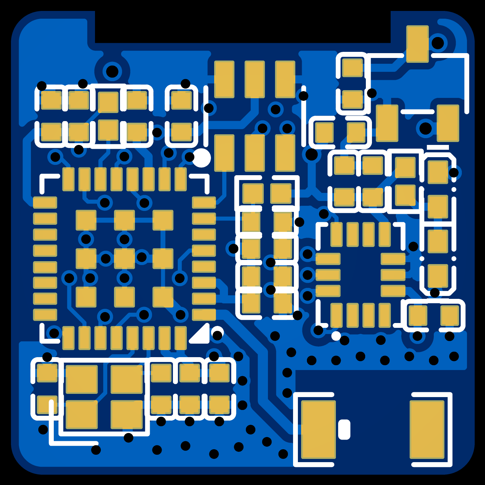
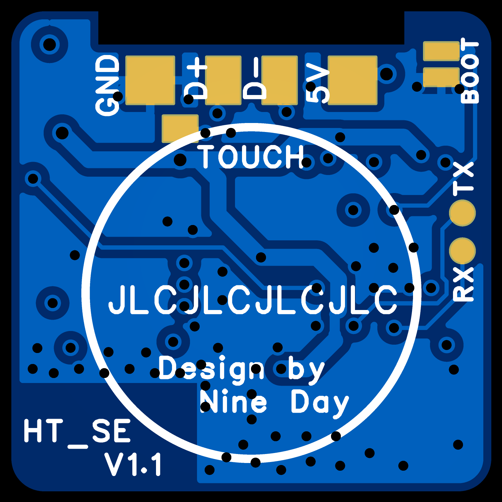
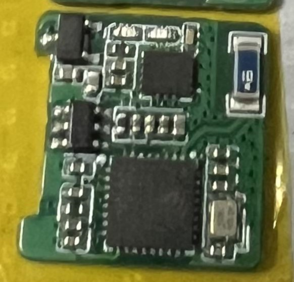
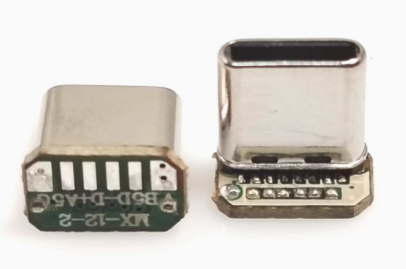
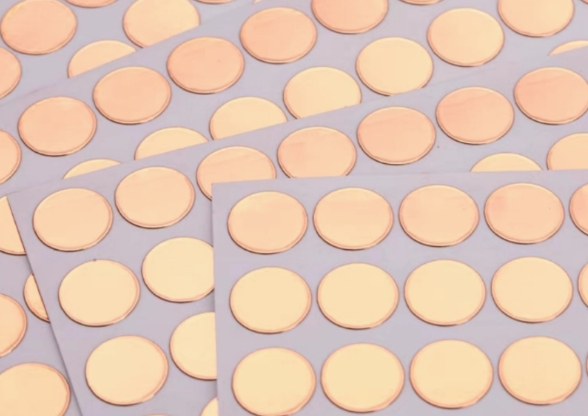
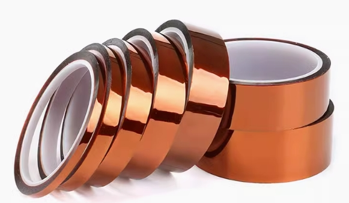
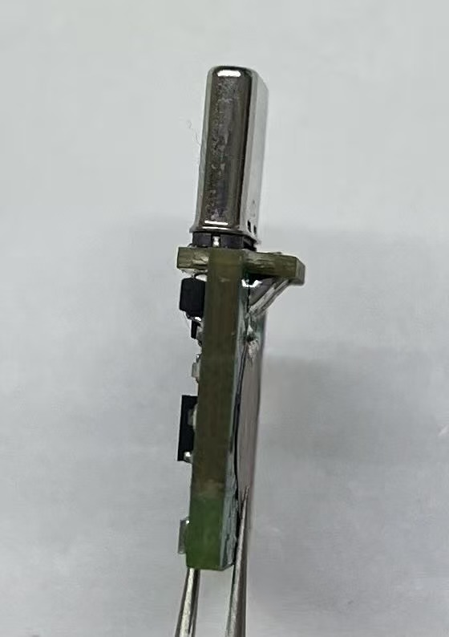
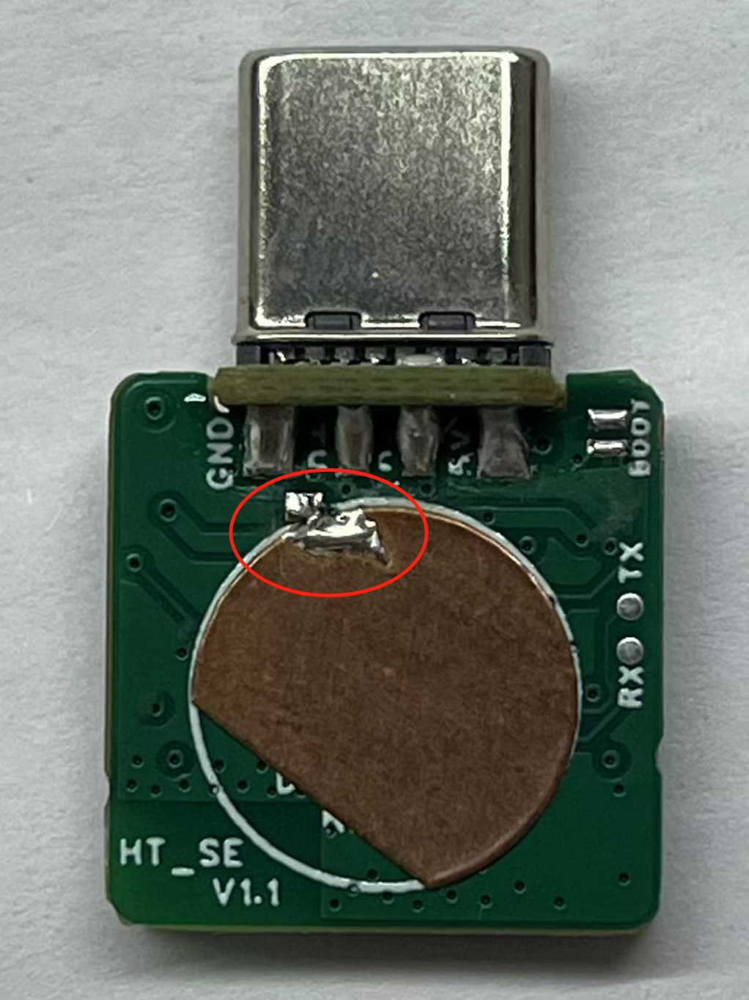
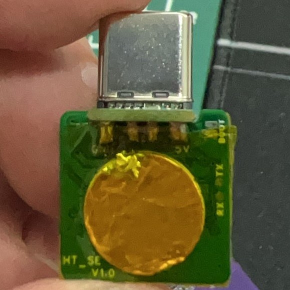
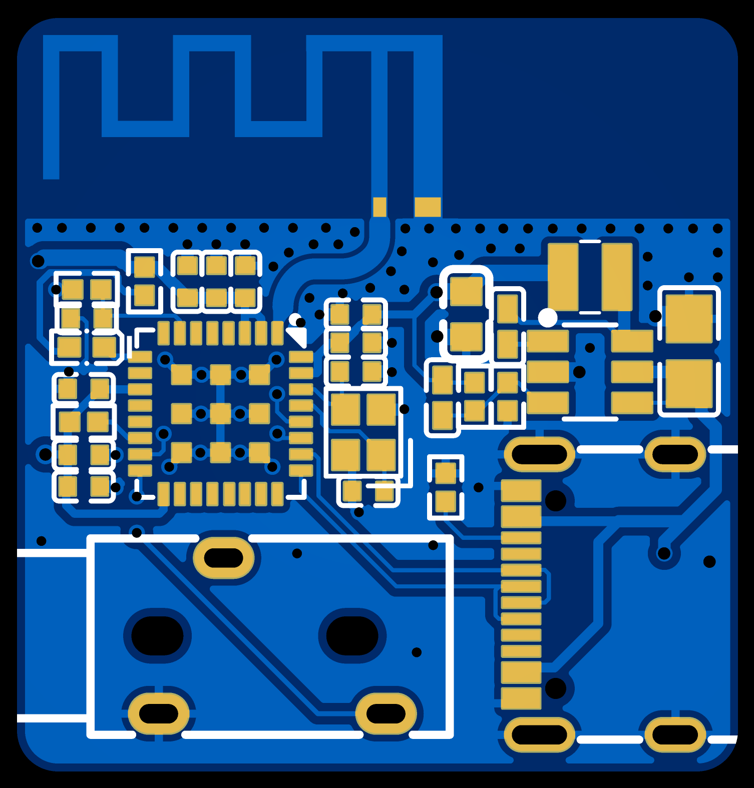

# SE PCBA

本页面会指导您完成 **SE 版** 头追硬件的制作，包括**发射端**和**接收端**。

:::{note}
获取工程文件，请跳转至[立创开源广场](https://oshwhub.com/nineday/headtracker_esp32-se-ban-wu-xian-tou-zhui)
:::

:::{note}
SE 版硬件尚未正式发布，信息待后续完善。固件需要使用 `v1.1.x` 以上。
:::

# SE 发射端

## PCB

本项目的 PCB 工程使用**立创 EDA 专业版**设计。 DIY 玩家可以通过嘉立创每个月的免费打样活动来免费打板。  

### 2D 图概览

::::{grid} 2

:::{grid-item}

:::
:::{grid-item}

:::
::::

:::{note}
PCB 下单时，成品板厚选择 **1.6**，板材选择 **JLC04161H-7628**。
:::

(ht-se-bom)=
## 物料清单

详细物料清单(BOM)，点击下载BOM。[BOM_HT_se.xlsx](../../_static/BOM_HT_se.xlsx)

:::{dropdown} 预览物料清单（SE TX）
:icon: table
:animate: fade-in-slide-down 
<!-- :open: -->

```{csv-table}
:file: ../../_static/BOM_HT_se.csv
:delim: tab
:header-rows: 2

```
:::

## 焊接组装

:::{note}
SE 版为单面贴片焊接，焊接较为容易。因此 SMT 部分不在此介绍。。
:::


### 1. 准备材料
你可以通过嘉立创进行贴片，或者自己采用回流焊焊接贴片原件。

贴片完成后，你需要准备以下材料：

| 序号 | 材料名称         | 图片                                                         |
|------|------------------|--------------------------------------------------------------|
| 1    | 贴片好的主板      |  |
| 2    | 带板 Type-C 公头   |    |
| 3    | 铜箔片           |         |
| 4    | 耐高温胶带        |      |

### 2. 焊接 Type-C

::::{grid} 1 2 2 2

:::{grid-item-card}
将 Type-C 公头与主板焊接。

将主板的四个焊盘与 Type-C 公头的四个焊点焊接。注意焊接时要确保 Type-C 公头的方向正确。
:::

:::{grid-item}

:::

::::

### 3. 焊接铜箔片

::::{grid} 1 2 2 2

:::{grid-item-card}
铜箔片为触摸的感应区域。

1. 将铜箔片减去一角，然后贴到圆形丝印区域内。
2. 将 `TOUCH` 引脚与铜箔片用焊锡短接。
:::

:::{grid-item}

:::

::::

### 4. 烧录固件
1. 短接 `BOOT` 焊盘。
2. 将头追的 Type-C 公头连接到电脑。
3. 使用烧录工具烧录固件（参考 [Nano 版烧录教程](Nano_PCBA.md#ht-nano-flash) 中的电脑操作部分）。
4. 烧录完成后，断开 `BOOT` 焊盘。

### 5. 贴耐高温胶带

::::{grid} 1 2 2 2

:::{grid-item-card}
裁剪合适长度的耐高温胶带，贴在铜箔侧的一面。

电容触摸必须要**贴耐高温胶带才能工作**，不能直接让手指与铜箔片接触。
:::

:::{grid-item}

:::

::::

***

# Nano 接收端

## PCB

### 2D 图概览

::::{grid} 1 2 2 2

:::{grid-item}

:::
:::{grid-item}

:::
::::

(rx-se-bom)=
## 物料清单

详细物料清单(BOM)，点击下载BOM。[BOM_RX_se.xlsx](../../_static/BOM_RX_se.xlsx)

:::{dropdown} 预览物料清单（SE RX）
:icon: table
:animate: fade-in-slide-down 
<!-- :open: -->

```{csv-table}
:file: ../../_static/BOM_RX_se.csv
:delim: tab
:header-rows: 2

```
:::

## 焊接组装

:::{card}
接收端较为简单，贴片完成后，烧录固件即可。

烧录固件同发射端，短接 `BOOT` 焊盘，连接 Type-C 到电脑，使用烧录工具烧录固件。

再此不过多赘述。
:::