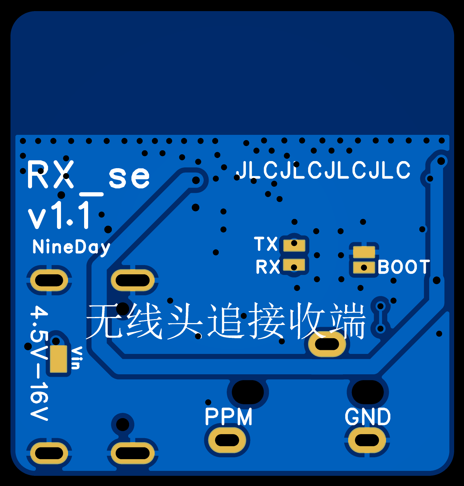

# SE PCBA

本页面会指导您完成 **SE 版** 头追硬件的制作，包括**发射端**和**接收端**。

:::{note}
获取工程文件，请跳转至[立创开源广场](https://oshwhub.com/nineday/headtracker_esp32-se-ban-wu-xian-tou-zhui)
:::

:::{note}
SE 版硬件尚未正式发布，信息待后续完善。
:::

# SE 发射端

## PCB

本项目的 PCB 工程使用**立创 EDA 专业版**设计。 DIY 玩家可以通过嘉立创每个月的免费打样活动来免费打板。  

### 2D 图概览

::::{grid} 2

:::{grid-item}

:::
:::{grid-item}

:::
::::

(HT_SE_BOM)=
## 物料清单

## 焊接组装

# Nano 接收端

## PCB

### 2D 图概览

::::{grid} 1 2 2 2

:::{grid-item}

:::
:::{grid-item}

:::
::::

(RX_SE_BOM)=
## 物料清单

## 焊接组装